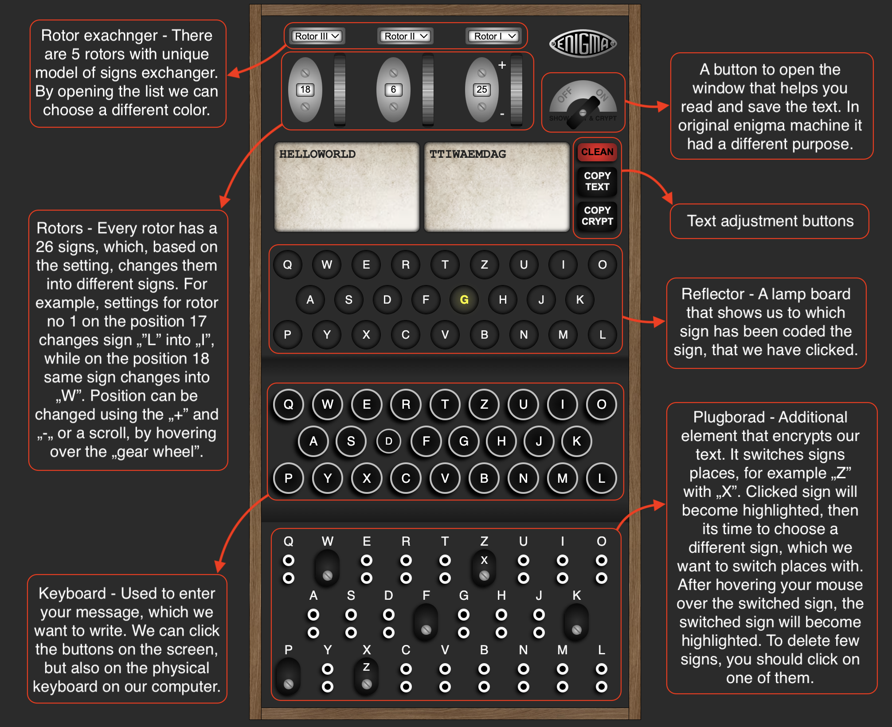

Enigma is a simple application simulating a German encryption and decryption machine.
When creating the application, I used tools such as TypeScript, React.js, MaterialUI.

<a>https://bgal23.github.io/enigma/</a>

Below I am posting a short instruction of the application's operation.

Or run it on your own computer:

<ol>
<li>Download the repository.</li>
<li>Run the development server <code>npm run dev</code>.</li>
<li>Open <a>http://localhost:5173/enigma</a></li>
</ol>

Have fun 😊
